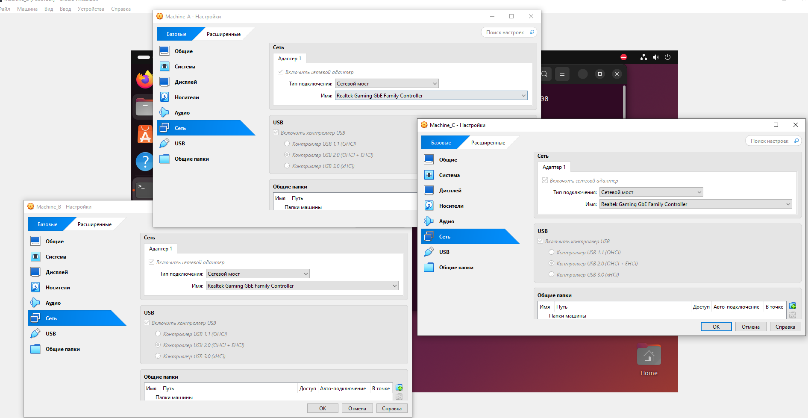
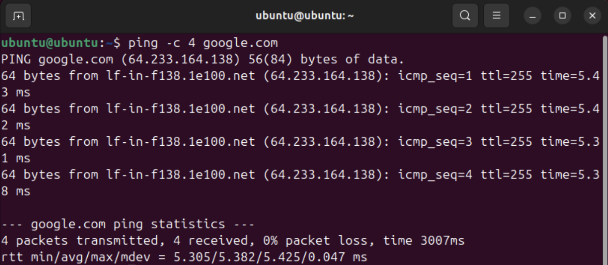
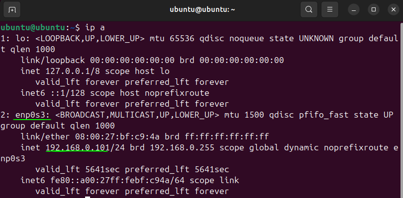
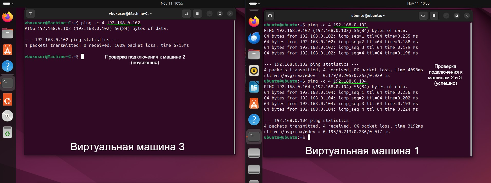

# Отчёт по лабораторной работе: Настройка виртуальных машин в VirtualBox

## Цель работы

В данной лабораторной работе необходимо настроить три виртуальные машины с операционной системой Linux в VirtualBox: обеспечить доступ к Интернету для машин, настроить сетевой доступ между машинами А, Б и В, а также запретить подключение из машины Б в машину В.

## Шаги реализации

### 1. Настройка сетевого подключения для всех виртуальных машин
- Для всех трёх машин (А, Б и В) был настроен тип подключения **сетевой мост** в VirtualBox, что позволяет каждой машине быть в одной сети с основным компьютером и друг с другом. Скриншот приложен ниже. 

### 2. Проверка доступа к Интернету
- Проведена проверка доступа к Интернету с машины А с помощью команды `ping google.com`. Результаты пинга подтверждают успешное подключение к Интернету (приложен скриншот).
- Подобные проверки были также выполнены на машинах Б и В, что подтверждает успешное подключение каждой машины к Интернету.
  

### 3. Определение IP-адресов виртуальных машин
- На каждой машине были выполнены команды `ip a`, чтобы определить их IP-адреса для дальнейшей настройки и проверки соединений. Ниже приведен скриншот с демонстрацией команды.
  

### 5. Создание машины В и настройка сетевого доступа между А, Б и В
- Все машины были созданы с типом подключения **сетевой мост**, что позволило им получить IP-адрес и быть в одной сети.
- Была проведена проверка подключений с помощью `ping` между машинами A, B и C (приложены скриншоты).
- На машине В был настроен брандмауэр с использованием `iptables`, чтобы запретить все входящие подключения с IP-адреса машины Б.
- Для этого была выполнена команда:
  ```bash
  sudo iptables -A INPUT -s <IP-адрес Машины Б> -j DROP
  ```
- Это запретило подключение из Машины Б в Машину В, подтверждено попытками пинговать (приложен скриншот).
  

## Выводы
В результате проделанной работы были настроены три виртуальные машины в VirtualBox. Обеспечен доступ в Интернет для всех машин, настроена сетевая взаимодействие между машинами А, Б и В, а также был настроен ограничение на доступ из Машины Б в Машину В. Работа выполнена успешно, цели достигнуты.
